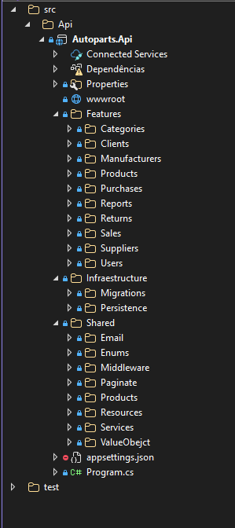
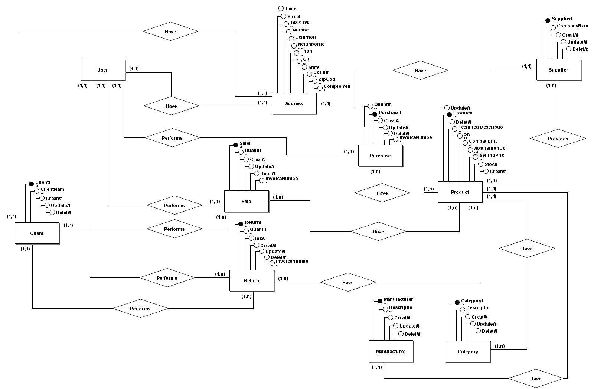

# Autoparts API — Vertical Slice Architecture

**Autoparts API**, um projeto desenvolvido em .NET Core 9 adotando Vertical Slice Architecture para máxima coesão, separação de responsabilidades e escalabilidade. Este projeto serve como base para aplicações modernas com **DDD, CQRS, MediatR, FluentValidation, Identity, Entity Framework Core, SQL Server**.

---
## 📘 Documentação

### [📄 Acessar os requisitos do projeto (PDF)](docs/HST.pdf)
---

## 🚀 Tecnologias Utilizadas

<!-- .NET 9 Web API -->


<!-- Vertical Slice Architecture -->


<!-- CQRS + MediatR -->


<!-- DDD -->
-02569B?style=for-the-badge&logo=domain&logoColor=white)

<!-- FluentValidation -->


<!-- EF Core + SQL Server -->


<!-- ASP.NET Core Identity -->


<!-- Temporal Tables -->


<!-- JWT Auth -->


<!-- FastReport -->


<!-- Z.PagedList -->


<!-- Minimal APIs -->


<!-- Swagger -->


---

## 📁 Estrutura do Projeto (Vertical Slice)

A arquitetura é organizada por features, não por camadas. Cada funcionalidade contém tudo o que é necessário para existir isoladamente.



---

## 🛢️ Diagrama Entidade-Relacionamento (Conceitual)

 
 
---

## 🛡 Validações e Regras de Negócio

- Validações no domínio, não em DTOs
- FluentValidation aplicado direto nas entidades
- Middlewares transformam exceções em respostas JSON padrão

---
## ▶️ Como Rodar o Projeto
### 1. Clone o repositório

```cmd
git clone https://github.com/andredobbss/autoparts
cd autoparts
```

### 2. Configure a connection string
#### 2.1 Crie uma variável de ambiente com o nome `"DEFAULT_CONNECTION_AUTOPARTS"` com o valor da string de conexão
#### 2.2 Crie um `appsettings.Development.json` com:

```cmd
{
  "ConnectionStrings": {
  "DefaultConnection": "Server=SERVER_NAME;Database=Autoparts;User ID=sa;Password=*******; Trusted_Connection=False;TrustServerCertificate=True"
  }
}
```
### 3. Execute as migrations

```cmd
dotnet ef database update -s Autoparts.Api
```
### 4. Execute a API

```cmd
dotnet run --project Autoparts.Api
```
---

## 🌐 Endpoints (exemplo minimal API)

```csharp
group.MapGet("/", async (ISender mediator) =>
{
  var result = await mediator.Send(new GetAllUsersQuery());
  return Results.Ok(result);
});
```

## 📝 Licença
Este projeto é distribuído sob a licença MIT.
